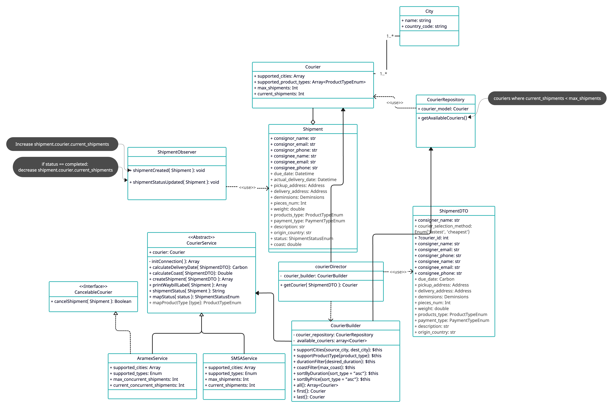

# Zid Coding Task
This is the implementation of Zid coding task

### Implementation Class Diagram


### Explanation
👉 This implementation is designed with extendability and ease of use in mind.

👉 The design accommodates a dynamic array of couriers through an abstract class that serves as a contract for newly integrated couriers. This enables our CourierDirector class to automatically select them if they align with the shipment properties.

👉 The system manages each courier's capacity by setting a maximum shipment count, only presenting couriers that haven't reached their limit. This functionality is facilitated by an observer class that increments the current shipments of the courier when a new shipment is created, and decrements it when the order status is marked as completed.

👉 The client can effortlessly opt for a specific courier or request the system to choose the most suitable one based on a diverse range of selection criteria, including:

- Support for both source and destination cities
- Compatibility with specific product types
- Ability to deliver before or on a specified due date
- Charges equal to or below a set amount
- Fastest delivery among the available options
- Most cost-effective option among the available ones.

Furthermore, extending these criteria is a breeze - adding a single function for each new criterion adheres to the Open Closed principle, ensuring our codebase remains neat and user-friendly, all thanks to our CourierBuilder pattern.

### Requirements
- PHP 8.x
- Composer
- Laravel 10.x
- MySQL 

### Installation
### Docker
- Clone the Repo
- `cd` to the project folder
- Add alias to sail `alias sail='[ -f sail ] && sh sail || sh vendor/bin/sail'`
- Install the dependencies
```
docker run --rm \
    -u "$(id -u):$(id -g)" \
    -v "$(pwd):/var/www/html" \
    -w /var/www/html \
    laravelsail/php82-composer:latest \
    composer install --ignore-platform-reqs
``` 
- Start the project `sail up`
- Run the migrations `sail artisan migrate`
- Run the seeders `sail artisan db:seed`
- Run the test cases `sail artisan test`

### Local machine installation
- Clone the Repo
- `cd` to the project folder
- Install the dependecies `composer install`
- run `cp .env.example .env`: 
- Set your database credentials in .env file: 
- Run the migrations `php artisan migrate`
- Run the seeder `php artisan db:seed`
- Start the server `php artisan serve`
- Run the test cases `php artisan test`

### API Usage
Find the postman collection under the root of the project, file name `Zid Task.postman_collection.json`
